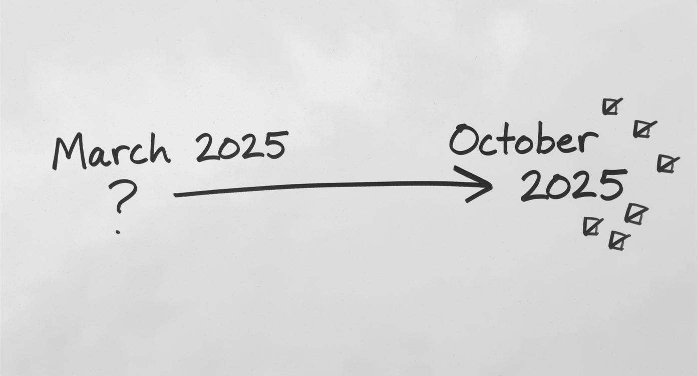

::: {.notes}
In March, we sat in this room and talked about AI in education - the challenges, the possibilities, the uncertainties. That conversation ended with questions.

Today, I'm here to share what happened next. Not theories or predictions, but actual stories from the last six months. What our faculty tried, what worked, what didn't, and what we're learning.

This is a progress report on a journey that's still unfolding. And I need your help to navigate where we go next.
:::

---

# The Journey Begins

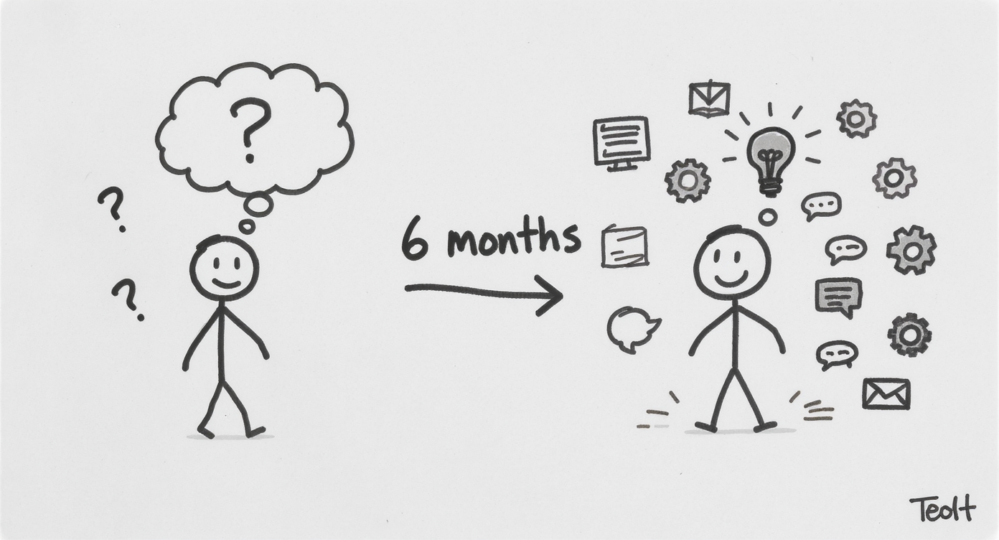

::: {.notes}

**March 2024: We Asked Questions**

* What challenges will we face?
* How should we respond?
* What do students need?

**October 2024: We Have Answers**

* Real adoption patterns
* Actual use cases
* New questions

In March, we were asking fundamental questions. There was uncertainty. Fear, even. "Should we use AI?" "Aren't students cheating?" "Will this replace us?"

Six months later, something shifted. I sent a simple email to faculty last week asking: "How are you using AI?" I expected maybe a handful of responses.

Instead, I got this [gesture to the right side of sketch]. Faculty across disciplines, sharing stories of experimentation, adaptation, innovation. The question changed from "Should I?" to "How should I?"

That shift - from paralysis to practice - that's what I want to explore with you today.
:::

---

# The Email That Revealed Everything

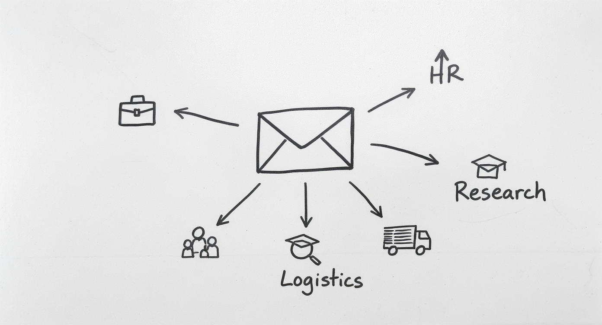

::: {.notes}

**A Simple Question:**

> "How are you currently using AI in your work?"

**What Came Back:**

* Business: Creating simulations & scenarios
* HR: Planning for workforce analytics
* Logistics: Designing workshops
* Research: Critique and validation
* Education: Graphic image novels

Here's the actual email I sent. [Gesture to envelope] One question. No pressure. Just curiosity about where we're at.

And what came back was fascinating. Not because everyone is doing the same thing - but because everyone is doing something different. [Point to each arrow/icon as you mention it]

Katharina in Business is using AI to create crisis simulations - social media posts, news bulletins, phone transcripts.

Sandra in HR is planning to integrate it into workforce planning and recruitment units.

Liz in Logistics uses it to brainstorm workshop designs she hadn't thought of.

And Renée - we'll come back to her story - is doing something that's never been done in an Australian university.

Each discipline is finding its own path. But patterns are emerging.
:::

---

# Four Patterns of Adoption

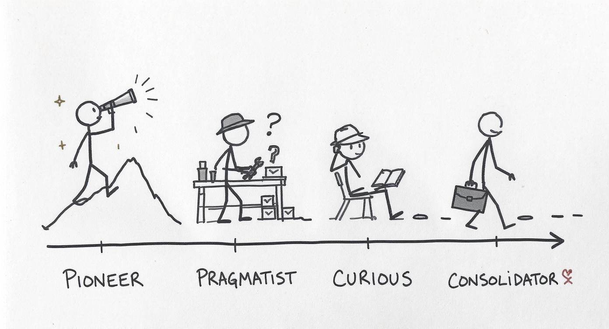

::: {.notes}

**The Pioneers** → Pushing boundaries  
**The Pragmatists** → Solving specific problems  
**The Curious** → Planning experiments  
**The Consolidators** → Building habits  

*All moving from hesitation to strategy*

When I analyzed the responses, four patterns emerged. [Point to each figure]

The PIONEERS like Tomayess and Farveh are exploring cutting-edge tools - Claude Opus for feedback mechanisms, AI for sentiment analysis and thematic analysis in research. They're the scouts.

The PRAGMATISTS like Tony aren't chasing innovation - they're solving problems. "I need test bank questions. AI can help. Let me try it." Practical. Grounded.

The CURIOUS like Sandra haven't implemented yet, but they're actively planning. "I want to incorporate this into my 2026 units." They're watching, learning, preparing.

The CONSOLIDATORS like Bella learned techniques from training last year and are now just... using them. It's become normal. Habitual.

But here's what matters: every single person who responded has moved past the question of "Should I?" They're past the hesitation. They're in the "How do I do this well?" phase.

And that's a fundamental shift.
:::

---

# Breaking Through AI Hesitation

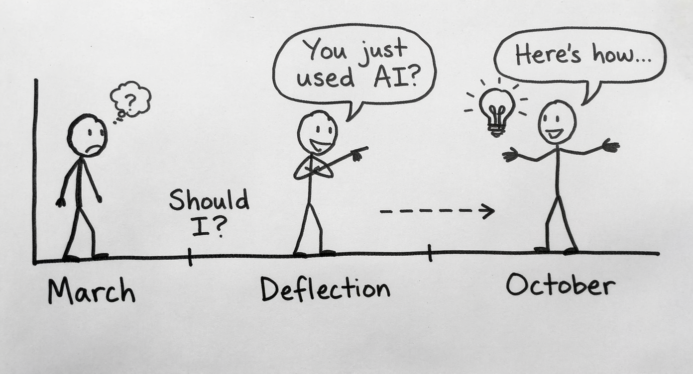

::: {.notes}
**March 2024:**  
"Should I really be using this?"

**The Middle Zone:**  
"*You* used AI?" (defensive dismissal)

**October 2024:**  
"Here's how I use it effectively"

*From hesitation → through deflection → to confident practice*

In March, I talked about a barrier I was seeing: **AI hesitation**. [Point to Figure 1]

Faculty uncertain about whether using AI was legitimate. Students hiding that they'd used ChatGPT for brainstorming. This sense of "Should I really be doing this? Is this allowed? Does this make me less of an academic?"

This hesitation is natural. When norms are unclear, caution makes sense.

But here's what I've learned: hesitation doesn't always lead directly to confidence. [Point to Figure 2] Sometimes there's a middle stage: **defensive dismissal**.

Let me give you a concrete example. A colleague shares they used AI to generate quiz questions. Another faculty member responds: "Well, *I* still write mine by hand." 

Pause and listen to the subtext: "My way is more legitimate. More rigorous. More *real*."

**"Oh, you just used AI."** [Say this with slight dismissive tone]

Now sometimes that's a valid concern - sometimes AI use *is* a shortcut that bypasses learning. But often - and this is the key insight - that dismissal is more about the speaker than about the work being dismissed.

**It's easier to dismiss someone else's AI use than to examine your own hesitation about trying it.** [Pause - let this land]

If I can frame your AI-assisted work as "cheating" or "not real work," then I don't have to confront my own uncertainty. I don't have to admit I'm behind. I can stay comfortable in my hesitation by making it a virtue.

But here's what happens when you push past that [Point to Figure 3]: The people who moved from hesitation to confident experimentation - Tomayess, Tony, Renée - they're not doing less rigorous work. They're often doing *more* ambitious work.

[Quick examples - 30 seconds each:]
- Tony discovered AI's limitations and turned them into pedagogy
- Renée created an entirely new assessment format  
- Tomayess is exploring sophisticated feedback mechanisms

**The shift from hesitation to confidence isn't about abandoning standards. It's about developing new expertise.**

And here's what gives me hope: Almost everyone who responded to my email has made that shift [gesture across to Figure 3]. They're past the "Should I?" question. They're past the defensive dismissal phase. They're experimenting, learning, sharing openly.

Will some people still dismiss AI use? Absolutely. That's part of any technological transition. Calculators would "ruin math." Spell-check would "destroy writing." 

But those dismissals shouldn't stop us from developing expertise with tools that are already reshaping how work gets done.

The question isn't whether to use AI. It's whether we develop that expertise deliberately and thoughtfully - [gesture to confidence figure] or whether we let hesitation keep us from preparing students for reality.

[Transition to next slide]:
So what does that confident practice actually look like across disciplines? Let me show you the patterns that emerged...
:::

---

# Discipline-Specific Patterns

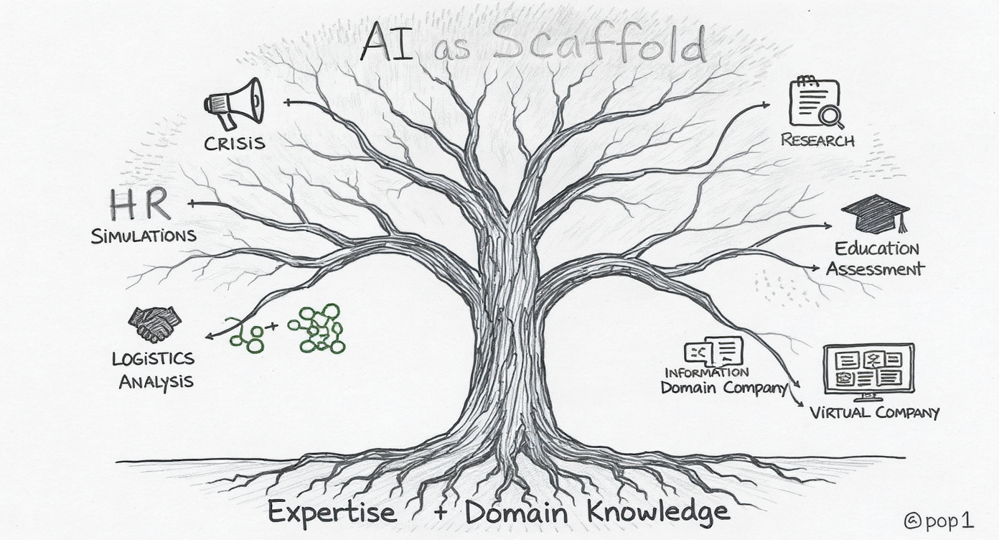

::: {.notes}

**Different Fields, Different Applications**

* Crisis Management → Simulation artifacts
* HR → Workforce planning tools  
* Logistics → Workshop ideation
* Research → Writing critique & analysis
* **Information Systems → Virtual workplace with AI employees**

*AI as scaffold, not replacement*  
*Expert evaluation remains essential*

What's fascinating isn't that everyone is using AI - it's that each discipline is finding its own applications. [Gesture to tree branches]

Katharina in crisis management needs realistic artifacts - fake social media posts, news bulletins, phone transcripts. AI excels at generating plausible content for simulations. She's not replacing critical thinking - she's creating better scenarios to practice it.

Sandra in HR sees AI's potential in workforce planning and recruitment - areas where data analysis and scenario planning are crucial. The AI doesn't make hiring decisions, but it can help students practice the analysis.

What I love about Liz's approach in logistics: she uses AI for ideation - "Give me workshop ideas I haven't thought of." It's expanding her creativity, not replacing it.

And in research - multiple faculty mentioned using AI to critique their writing, check their analysis. They're using it as a sophisticated second pair of eyes.

[Point to Information Systems branch] Here's an example from my own teaching: I created a virtual company staffed by AI chatbot employees - finance director, HR manager, IT support. Students have to navigate this workplace, extract information, make decisions. But I'm marking their conversations. The questions they ask. How they evaluate responses. The AI isn't doing their work - it's creating an authentic environment for demonstrating workplace competence. This wasn't possible before AI, but it's incredibly valuable for preparing students for real workplaces where they'll interact with AI systems.

But notice the pattern [point to trunk and roots]: In every case, faculty expertise guides the AI. They evaluate outputs, correct errors, integrate results. **This is crucial: AI tools are powerful, but they make mistakes. Hallucinations, bias, outdated information. The solution isn't to avoid AI - it's to use domain expertise as the quality control.** Students need to learn this same pattern.

The AI is a scaffold for expertise, not a replacement of it. This is crucial for how we teach students to use these tools.
:::

---

# Common Ground Across Disciplines

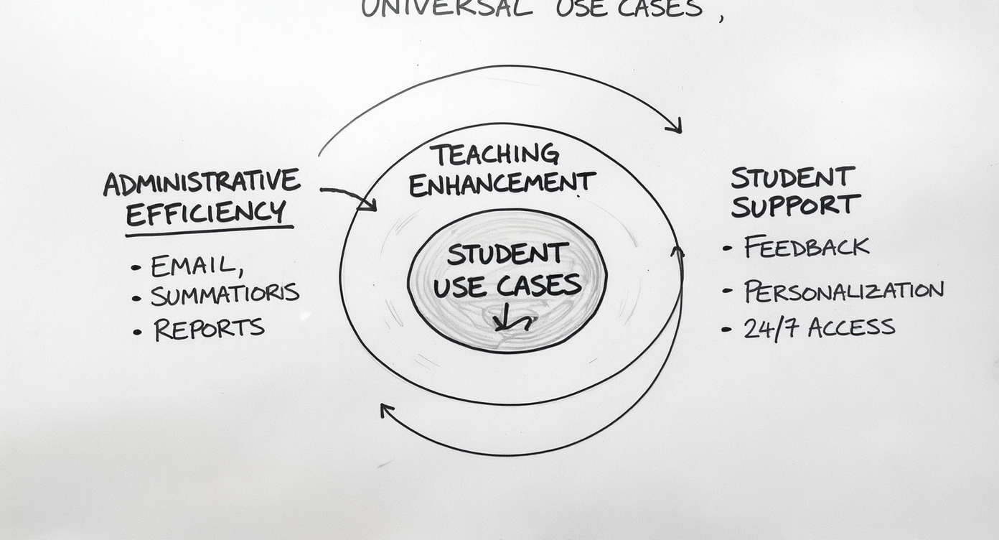

::: {.notes}

**Three Universal Use Cases:**

1. **Administrative Efficiency** → Email, summaries, reports
2. **Teaching Enhancement** → Slides, scenarios, examples  
3. **Student Support** → Feedback, personalization, 24/7 access

*Freeing time for uniquely human work*

Despite the different applications, three common patterns emerge across all disciplines. [Point to circles from outside in]

First: Administrative tasks. Almost everyone mentioned using AI for emails, summaries, documentation. The stuff that takes time but doesn't require deep expertise. One faculty member wants to create an agent to automatically categorize and draft email responses. That's not being lazy - that's being strategic about where to spend human attention.

Second: Teaching enhancement. Generating discussion questions, creating alternative explanations for difficult concepts, building case studies. AI is particularly good at "give me 10 variations of this" - expanding options for teachers to choose from.

Third: Student support. This one excites me most. [Point to center] AI can provide personalized feedback at 2am when a student is stuck. It can give infinite patience for "dumb questions" students are embarrassed to ask in class. It can adapt explanations to different learning styles.

But notice what's at the center [point to heart and shield]: Human connection AND human judgment. All of this administrative and teaching efficiency creates more time for the work only humans can do - mentoring, inspiring, making meaning, connecting concepts to lived experience. And critically, the expert evaluation that AI can't do itself. AI is a powerful first draft tool, but it requires expert review. That's not a bug - that's the workflow.

We're not replacing teachers. We're freeing teachers to be more human - and more critical.
:::

---

# The Critical Lesson - Tony's Story

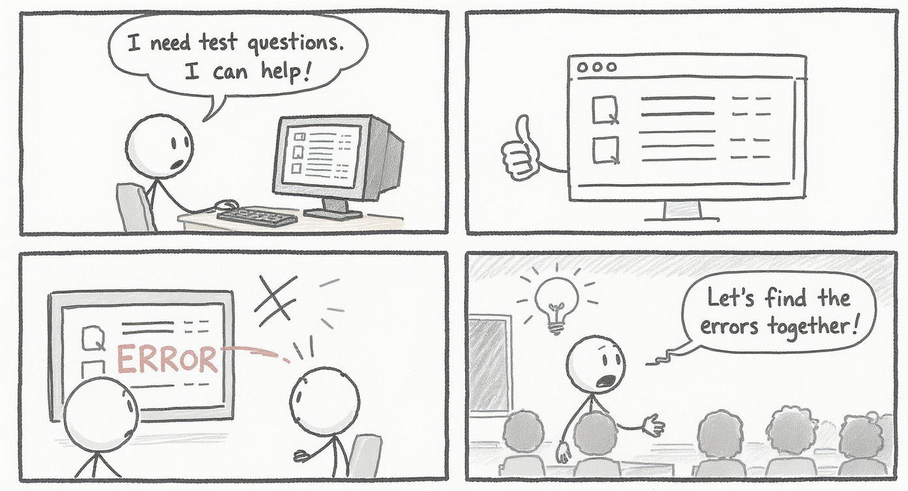

::: {.notes}

**The Test Bank Experiment:**

1. Asked AI to create revision questions ✓
2. AI generated questions ✓
3. AI got some answers WRONG ✓✓✓
4. Perfect teaching moment! ✓✓✓

*"But I included a disclaimer..."*

Let me tell you my favorite story from the email responses. [Point to Panel 1]

Tony, in Information Systems, decided to try using AI to create test bank revision questions. Straightforward use case - we've all made hundreds of these questions, it's time-consuming, AI should be good at it.

[Panel 2] So he prompts the AI, gets back a set of questions and answers. Looks good. Efficient.

[Panel 3] Then he checks them. Really checks them. And discovers: some of the answers are wrong.

Now, here's where this story could go one of two ways. Version One: "See! AI is dangerous! We can't use it!" Ban it, problem solved.

But Tony did something smarter. [Panel 4] He gave the questions to students WITH a disclaimer: "These were created with AI. Some answers may be wrong. Your job is to find them."

Suddenly, this isn't just test prep - it's critical evaluation practice. Students have to know the material well enough to catch AI errors. They can't just memorize - they have to understand.

The "failure" became the feature. The bug became the pedagogy.

This is what AI literacy looks like: Not blind trust. Not outright rejection. But informed, critical use backed by domain expertise.

Research suggests up to 30% of AI-generated content can contain errors - hallucinations, bias, drift from focused tasks. The solution isn't avoidance. It's exactly what Tony modeled: Use AI for focused tasks, apply domain expertise to evaluate outputs, and teach students to do the same.

And you can only develop that literacy if you let students use the tools - and learn to evaluate their outputs.

This is the workflow students need for their careers: AI as powerful first draft, human expertise as quality control.
:::

---

# Innovation in Action - Renée's Breakthrough

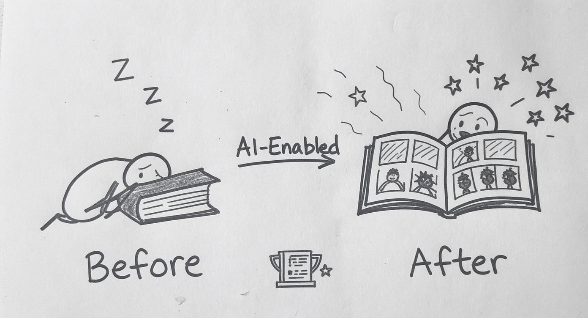

::: {.notes}

**First in Australia:**  
Graphic Image Novels for Master's Assessment

**Results:**
* Increased engagement ↑
* Better retention ↑  
* Published research ↑

*"From Intimidation to Innovation"*

I want to share one more story, because it shows what's possible when you embrace AI strategically.

Renée, in Human Resource Development, did something that's never been done in an Australian university. [Point to right side of sketch] She had her Master's students create Graphic Image Novels - essentially comic books - as team assessments.

Think about what this requires: visual storytelling, narrative structure, synthesis of complex concepts into accessible formats. Before AI tools made image generation accessible, this would have been impossible for most business students. The technical barriers were too high.

But with AI-assisted image creation, students could focus on the conceptual work - how to represent HRM concepts visually, how to structure a narrative, how to make complex ideas accessible.

The results? [Point to engagement indicators] Increased engagement, better retention, students actually excited about the assessment.

And here's the validation [point to publication icon]: Renée and her co-authors published this in Education Sciences journal in July. "From Intimidation to Innovation" - that title captures the journey.

She didn't use AI to make assessment easier. She used AI to make assessment more ambitious. More creative. More demanding of higher-order thinking.

This is what I mean by AI as scaffold, not shortcut. It enabled assessment that would have been prohibitively difficult before, but it didn't do the learning for students. If anything, it raised the bar.

Question for you: What other assessment innovations might be possible now that weren't before?
:::

---

# Strategic Implications for FBL

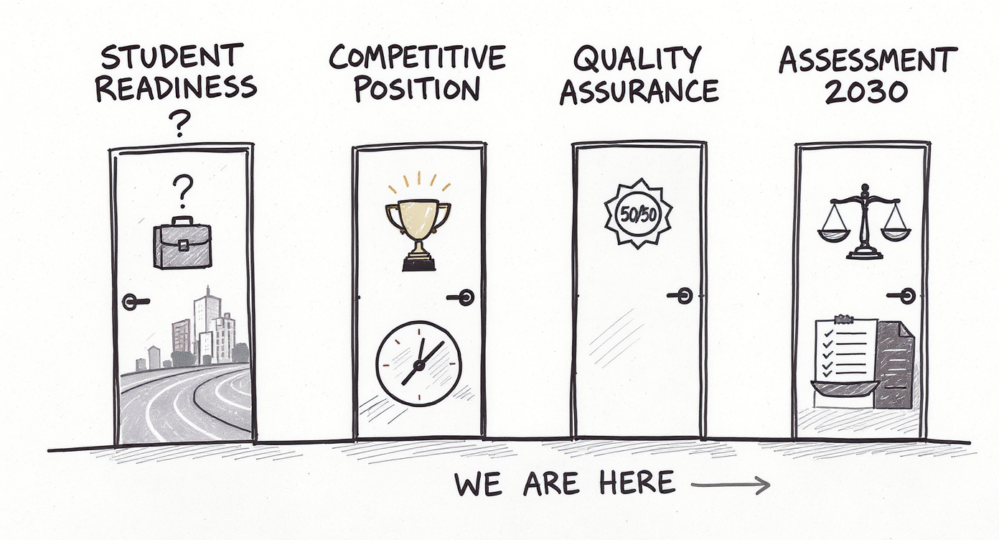

::: {.notes}

**Four Questions for Our Future:**

1. **Preparedness**: Are we training students for AI-enabled workplaces?
2. **Positioning**: First mover advantage vs. risk of falling behind
3. **Quality**: How do we ensure meaningful learning?
4. **Assessment**: Rethinking evaluation in the AI era *(Assessment 2030)*

*Moving from "Can we?" to "How well?"*

Six months of experimentation brings us to harder questions. Not "Should we use AI?" but "How well are we using it?" Four strategic challenges emerged.

[Point to Door 1] STUDENT PREPAREDNESS: One of the faculty responses stopped me cold. Renée wrote: "Public listed companies are using ChatGPT." That's the reality our graduates are entering. When they arrive at their first job, AI will be in the workflow. Are we preparing them for that? Or are we sending them into AI-enabled workplaces having spent their education avoiding or hiding AI use?

The gap between academic prohibition and industry practice is growing. We need to close it.

[Point to Door 2] COMPETITIVE POSITIONING: Renée's Graphic Image Novel assessment was a first in Australia. That's differentiation. That's innovation. But first mover advantages are temporary. Other institutions are moving too. The question isn't "Should we innovate with AI?" It's "How fast can we innovate responsibly?"

What's our risk tolerance? What's our appetite for experimentation?

[Point to Door 3] QUALITY ASSURANCE: And this is where it gets hard. How do we distinguish between AI as scaffold versus shortcut? How do we design assessments that use AI to raise the bar, not lower it? Tony's example showed one path - embrace the errors, teach critical evaluation. Renée's showed another - use AI to enable more ambitious work.

But we need frameworks, not just individual experiments.

[Point to Door 4] ASSESSMENT: This connects to Curtin's Assessment 2030 initiative. We're rethinking what assessment means in an AI era. It's not about prevention - locked browsers and exam rooms. It's about demonstration. Can students show their thinking? Their process? Their ability to evaluate and iterate?

My operating principle: Design assessments where at least 50% demonstrates individual student thinking - where AI can be a tool but not a replacement. Where we're assessing whether the student is DRIVING the AI, not being driven by it.

These aren't questions I can answer alone. I need your perspective.
:::

---

# What We Need From You

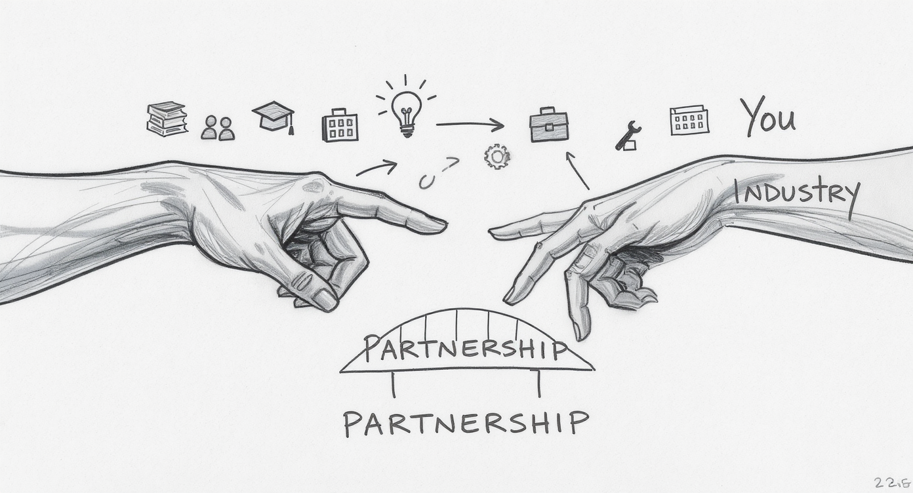

::: {.notes}

**Industry Perspective:**

* What AI skills do your organizations value?
* What capabilities are you seeking in graduates?
* Where are you seeing AI transformation?
* What mistakes do new employees make with AI?

**Partnership Opportunities:**

* Internships with AI components
* Real-world case studies  
* Guest perspectives on AI adoption

Here's where I need your help.

We're making progress. Faculty are experimenting. Students are adapting. But we're doing this somewhat in isolation from the workplaces our students will enter.

[Point to left hand] We can teach students to use AI tools. We can design assessments that develop critical evaluation skills. We can create policies around responsible use.

[Point to right hand] But you know what your organizations actually need. You're seeing AI transformation in real time. You're experiencing the challenges and opportunities firsthand.

[Point to the gap between hands] We need that knowledge to flow back into curriculum design.

Some specific questions: [Pause after each, make eye contact with different Board members]

- What AI skills are you actually looking for when you hire?
- Where are you seeing AI create new roles versus changing existing ones?
- What mistakes are you seeing people make with AI that we should be teaching students to avoid?
- What does "AI literacy" actually mean in your workplace context?

And beyond just information sharing [point to bridge], there are partnership opportunities. Could students do internships where AI use is part of the learning experience? Could you share real case studies of AI implementation - successes AND failures - that we could use in teaching?

Could we bring industry speakers in to talk about how AI is actually changing your sectors?

Your expertise makes our teaching relevant. That's the bridge we need to build.
:::

---

# The Path Forward

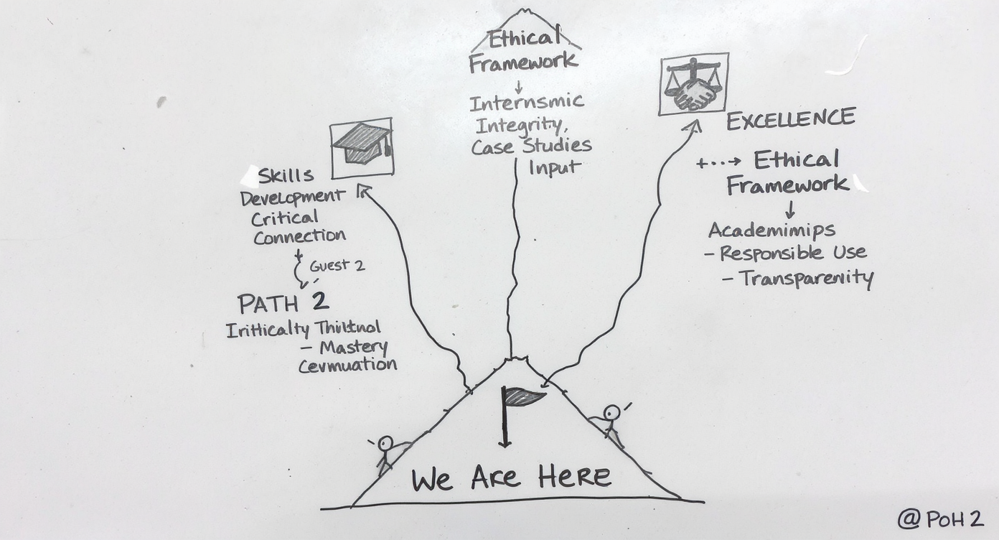

::: {.notes}

**Three Routes, Your Input Needed:**

→ **Skills Focus**: What to teach *(and where humans add value)*  
→ **Industry Partnership**: How to connect *(learning from your AI design)*  
→ **Ethical Framework**: How to govern *(organizational design, not just policy)*

*"We're past 'Should we?' – now it's 'How well?' - and that's a leadership question"*

So where do we go from here? [Point to "We Are Here"]

We've established that we're past the "Should we use AI?" question. Faculty are experimenting. Students are adapting. The technology isn't going away.

But "using AI" isn't a destination - it's a starting point. The question now is: How well are we using it? How do we move from ad-hoc experimentation to strategic integration?

I see three paths forward, and they're not mutually exclusive. [Point to each path]

PATH ONE: Skills Focus. We need to define what AI literacy means for business graduates. Not "can you use ChatGPT" but "can you evaluate AI outputs? Understand limitations? Use AI to augment rather than replace thinking?" 

And critically - **where do humans add value?** I teach my students a 5-step framework for critiquing AI responses. I mark their AI conversations because the quality of their questions matters more than the AI's answers. This is about organizational design - where should human judgment sit in AI-enabled workflows?

PATH TWO: Industry Partnership. We need stronger connections between what we teach and what you need. Not just teaching about AI, but learning from how you're solving this in your workplaces.

Here's a critical insight from industry: The biggest barrier to effective AI adoption isn't the technology - it's figuring out where humans should be in the loop. **That's an organizational design question. A leadership question.** You're solving this right now in your businesses. We need to learn from your experience. Which brings us back to: where are the partnership opportunities?

PATH THREE: Ethical Framework. We need clear principles for when AI enhances learning and when it undermines it. But this isn't just academic integrity policy - it's pedagogical design. Tony's disclaimer approach, Renée's ambitious assessment design - these are design decisions about human-AI collaboration, not just rules about cheating.

[Point to peak] All three paths lead to the same destination: graduates who can work effectively in AI-enabled environments. Graduates who use AI as a tool for excellence, not a shortcut to mediocrity.

But here's what I've learned from both education and industry: The path forward isn't primarily technical. It's organizational. It's about **intentional design of where humans add value and where AI adds value.**

That clarity - that intentional design - is what separates institutions that thrive with AI from those that struggle.

And I can't map these paths alone. That's why I need your guidance.
:::

---

# Discussion & Next Steps

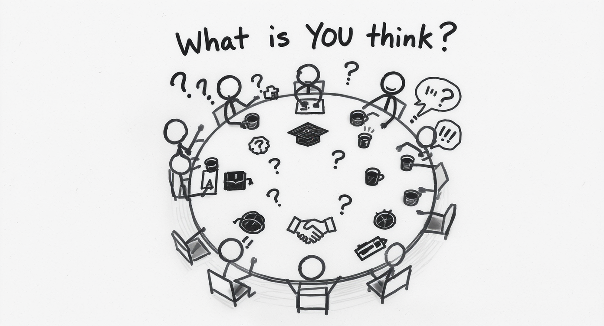

::: {.notes}

**Your Turn:**

* What resonates with your experience?
* What concerns you?  
* Where can we collaborate?

**Let's Talk**

So that's where we've been, where we are, and where we might go. [Gesture to sketch of round table]

But this isn't a lecture - it's a conversation. I've shared what faculty are doing. Now I want to hear from you.

I have some specific questions, but first: What's your immediate reaction to what you've heard? What surprises you? What concerns you?

[PAUSE - actually wait for responses]

[Depending on time and engagement, you can guide toward these specific questions:]

1. From your hiring and workplace perspective: What AI capabilities do you wish business graduates had? What mistakes do you see new employees making with AI?

2. Are there specific projects or initiatives in your organizations that students could learn from - either as case studies or through direct involvement?

3. What ethical challenges are you navigating with AI in your workplaces? How are you balancing efficiency with quality, automation with judgment?

4. Where do you see the biggest gaps between what we're teaching and what your industries need?

5. How are you thinking about assessment and evaluation of work in AI-enabled environments? What does quality look like when AI is in the workflow?

[The goal is genuine dialogue, not just Q&A. Listen, take notes, probe deeper on interesting points]

[CLOSING - save 2 minutes:]

Thank you. This is exactly the input I needed. The next six months will be about moving from individual experiments to strategic integration - and your guidance today helps chart that course.

I'll be following up with several of you about specific partnership opportunities. And I'd love to continue these conversations individually.

The AI revolution in education isn't coming - it's here. The question is whether we shape it intentionally or let it shape us by default.

With your help, I'm confident we can do the former.

Thank you.
:::

---

# Backup Slides

**Additional Topics (Click to Jump):**

[UNESCO's AI Education Roles](#UNESCO's AI Education Roles)
[Technical Infrastructure (FLX/Curator)](#The Technical Details (FLX/Curriculum Curator))
[March Questions Revisited](#Three Questions From March - Revisited)
[5-Step AI Critique Framework](#5-Step AI Critique Framework)
[Rethinking Assessment Security](#Rethinking Assessment Security)
[When AI Use Becomes Problematic](#When AI Use Becomes Problematic)
[The Real Barrier to Adoption](#The Real Barrier to AI Adoption)
[Human-in-the-Loop for Education](#Human-in-the-Loop for Education)

[Return to Discussion](#discussion)

---

# UNESCO's AI Education Roles

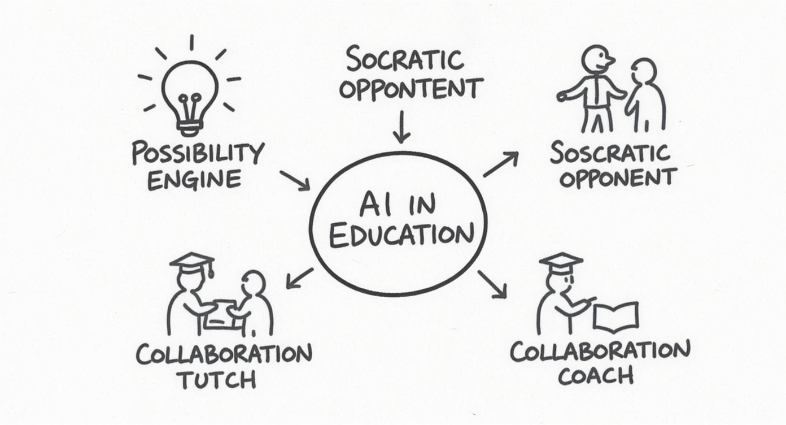

::: {.notes}

**Ten Ways AI Supports Learning:**

* Possibility engine
* Socratic opponent  
* Collaboration coach
* Personal tutor
* Study buddy

*Reference from March presentation*

[Only use if someone asks: "But specifically, how should students be using AI?"]

In March, I shared UNESCO's research on AI roles in education. I won't go through all ten, but the framework is useful.

AI as "possibility engine" - generate alternatives, explore options. 
AI as "Socratic opponent" - argue against your position to strengthen it. 
AI as "personal tutor" - patient, non-judgmental feedback.

The key: these are roles for AI as learning partner, not learning replacement.

Several of our faculty are already using these patterns, whether they know the UNESCO framework or not.
:::

---

# The Technical Details (FLX/Curriculum Curator)

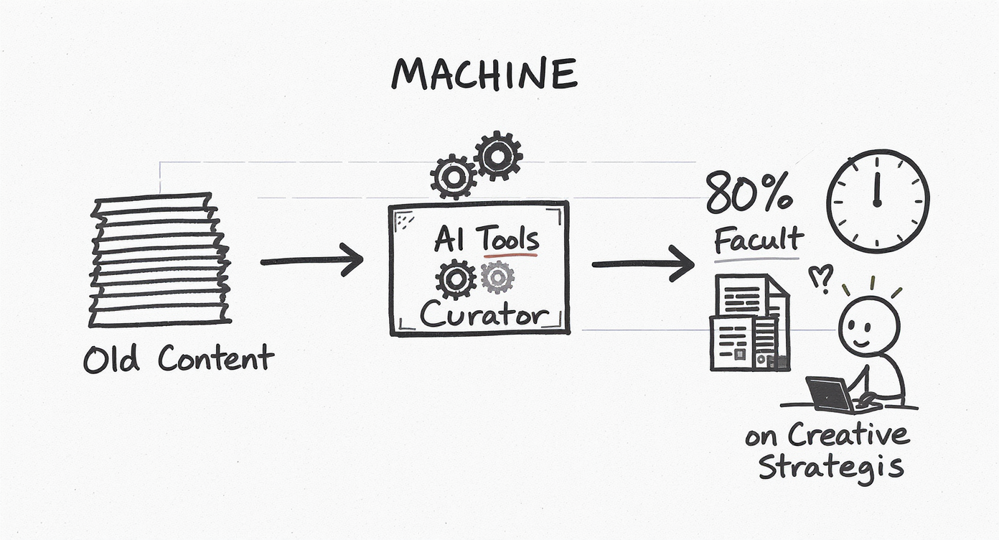

::: {.notes}

**Tools Supporting Faculty:**

* Curriculum Curator → Content transformation
* FLX → Module restructuring
* Time savings: 80%+ on formatting tasks

*Efficiency enables innovation*

[Only use if someone asks about technical infrastructure]

We're also investing in tools that support faculty efficiency. The Curriculum Curator and FLX tools help transform existing content into new formats - PDFs to interactive web experiences, static content to adaptive modules.

One colleague converted a worksheet to HTML in 30 minutes. Not replacing content expertise - just handling the technical busywork.

This matters because faculty time is the bottleneck. If AI can handle formatting and restructuring, faculty can focus on pedagogy and innovation.

It's the same principle we're teaching students: use AI for the mechanical so you can focus on the meaningful.
:::

---

# Three Questions From March - Revisited

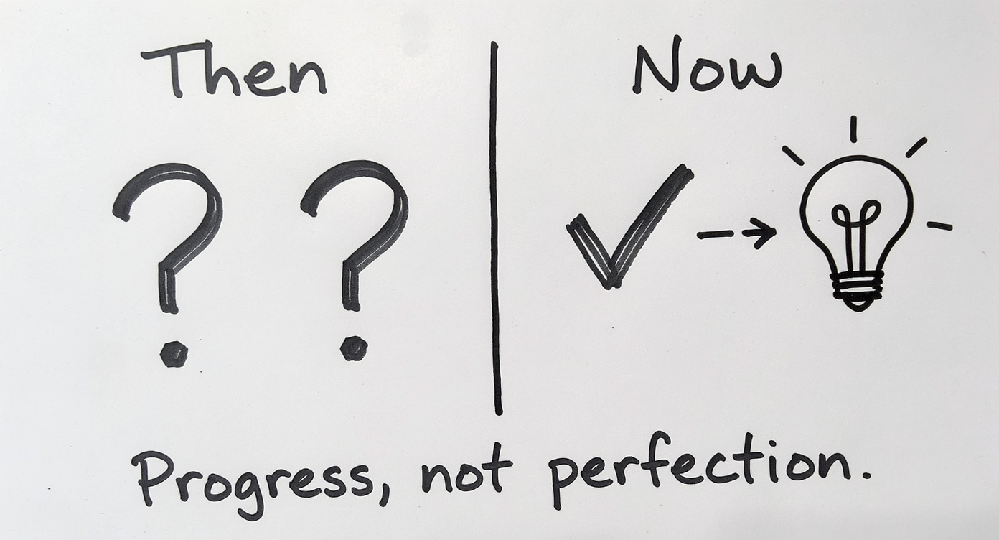

::: {.notes}

**March 2024 Questions:**

1. What AI skills are critical?  
2. How can we collaborate with industry?  
3. What ethical considerations?

**October 2024 Answers:**

1. Critical evaluation, not just use  
2. Real partnerships emerging  
3. New frameworks being tested

[Only use if you want to create explicit callback to March meeting]

In March, we ended with three questions for you. [Point to left column]

Six months later, we don't have complete answers, but we have better questions. [Point to right column]

We've learned that AI skills aren't about tool proficiency - they're about critical judgment. Tony's story proved that.

We've started building industry partnerships - but we need to scale them. That's where you come in.

And we're testing ethical frameworks in real time - every faculty experiment is generating data about what works.

We're making progress. But it's iterative, not complete. And that's okay.
:::

---

# 5-Step AI Critique Framework

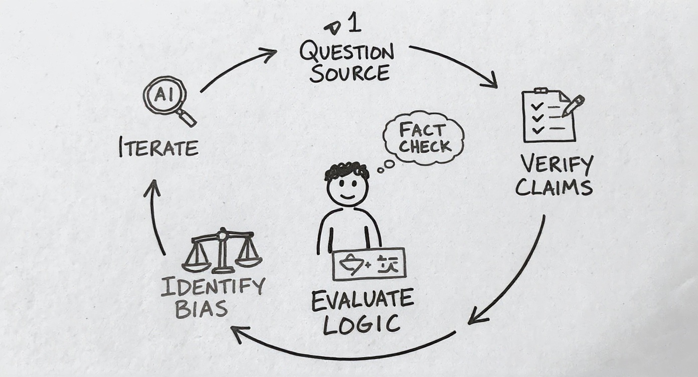

::: {.notes}

**Teaching Critical Evaluation:**

1. **Question the Source**: What's the AI's training? Limitations?
2. **Verify Claims**: Cross-check facts, especially statistics
3. **Evaluate Logic**: Does the reasoning hold up?
4. **Identify Bias**: What perspectives are missing?
5. **Iterate & Improve**: Use critique to refine prompts

*From passive consumption to active evaluation*

[Only use if someone asks: "How do you actually teach AI literacy?" or "What does your framework look like?"]

Great question. I teach my students a 5-step framework for critiquing AI responses. [Point to circle]

Step 1: Question the Source. What's this AI trained on? What are its known limitations? Students need to understand that ChatGPT, Claude, and Copilot have different strengths and weaknesses.

Step 2: Verify Claims. Especially statistics, dates, citations. AI hallucinates. Students must cross-reference against authoritative sources. If AI says "30% of businesses use this technology" - where's that number from?

Step 3: Evaluate Logic. Does the reasoning actually hold up? AI can produce plausible-sounding arguments that fall apart under scrutiny. Students need to spot logical fallacies, missing steps, or unsupported leaps.

Step 4: Identify Bias. What perspectives are missing? AI training data has biases - often Western, often based on available internet content. Students need to ask: "Who's voice isn't represented here?"

Step 5: Iterate and Improve. Use your critique to refine your prompts. This is where learning happens. "The AI gave me a shallow response - how can I ask a better question?"

[Point to center student figure] The goal is active evaluation, not passive consumption. 

And here's the key: I mark their AI conversations. I assess the sophistication of their questions, how they push back on weak responses, how they iterate. The AI is the environment for demonstrating critical thinking - not a shortcut around it.

This framework works across disciplines. Business students evaluating market analysis. HR students questioning bias in recruitment algorithms. IT students testing code explanations.

It's not about using AI less - it's about using it more critically.
:::

---

# Rethinking Assessment Security

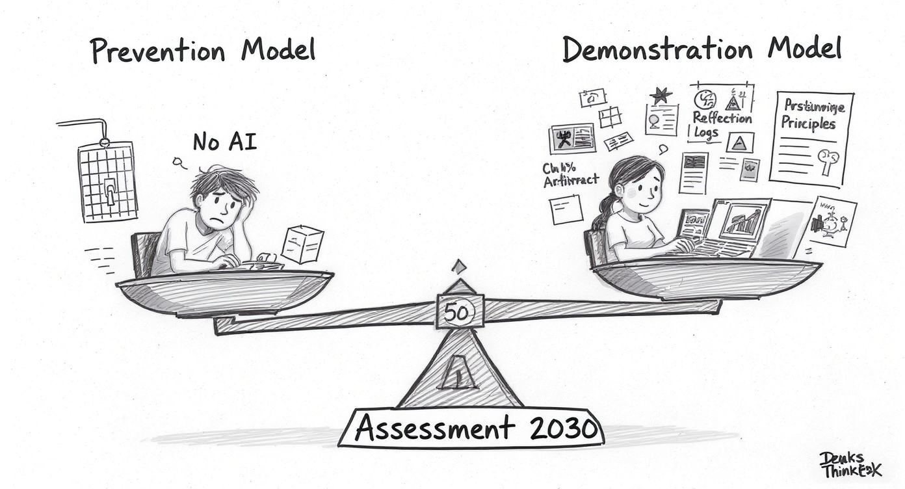

::: {.notes}

**Not About Prevention:**
* Traditional exams ≠ solution
* Detection tools ≠ reliable

**About Demonstration:**
* 50% demonstrable individual work
* AI-allowed but student-driven
* Process evaluation, not just product

**Examples:**
* Marking AI conversations
* Oral defense of AI-generated work
* Iterative development portfolios

[Only use if someone asks: "But how do you prevent cheating?" or "What about academic integrity?"]

Excellent question, and it gets to the heart of Assessment 2030 thinking. [Point to scale]

We've been focused on **prevention** [point to left side] - locked browsers, exam rooms, plagiarism detection software. But this is an arms race we can't win. AI detection tools have high false positive rates and are easily circumvented.

Instead, we're shifting to **demonstration** [point to right side]. Can students demonstrate their thinking? Their process? Their ability to evaluate and iterate?

[Point to fulcrum] My operating principle: At least 50% of any assessment must show the student's individual thinking. That doesn't mean AI is banned from the other 50% - it means we design assessments where AI can be a tool but not a replacement.

[Point to examples on right side] What does this look like practically?

**Marking AI conversations**: I assess the questions students ask, how they push back on AI responses, how they iterate. The conversation reveals their thinking.

**Oral defense**: Students use AI to generate initial content, but must defend it, explain alternatives they considered, identify limitations. Can't do that if AI did all the thinking.

**Iterative portfolios**: Show the development process. First draft, feedback (human or AI), revision, reflection. The learning is visible in the iteration.

[Point to Tony's and Renée's examples from earlier] Tony's approach - students find AI errors - requires deep understanding. Renée's graphic novels - AI helps with images, but students must demonstrate conceptual synthesis.

[Address the concern directly] Is this more work for faculty? Initially, yes. But it's more honest about the world students are entering. And frankly, it's better pedagogy - we're assessing understanding, not memorization or production.

The question isn't "How do we prevent AI use?" It's "How do we design assessment where AI use reveals rather than hides student thinking?"

That's the Assessment 2030 challenge - and opportunity.
:::

---

# When AI Use Becomes Problematic

::: {.notes}

**Red Flags:**

* Student can't explain "their" work
* No evidence of process/iteration  
* Work significantly beyond demonstrated ability
* Student resists questions about approach

**Response:**

* Conversation, not accusation
* Focus on learning, not punishment
* Opportunity to demonstrate understanding

[Only use if discussion turns to: "What do you do when you suspect AI misuse?"]

This is sensitive territory, but important. [Point to traffic light]

[RED] There are red flags that suggest problematic AI use: Student submits work but can't explain their approach. No drafts or evidence of process. Work dramatically beyond what they've demonstrated in class. Resistance to discussing methodology.

But here's the critical point: [Point to YELLOW] These flags mean "have a conversation," not "make an accusation."

I approach these situations with curiosity, not judgment: "This is interesting work - walk me through your thinking. What alternatives did you consider? Where did you get stuck?"

Often, legitimate AI use will be revealed. Student says: "I used ChatGPT to generate initial ideas, then I refined based on the readings and class discussion." That's fine - that's the workflow we're teaching.

Sometimes, problematic use is revealed. Student can't articulate any of the concepts in their own work. But even then, the response is educational [point to supportive figure], not punitive.

"It seems like you might have relied too heavily on AI here. Let's talk about how to use it as a scaffold for your thinking, not a replacement. Can you demonstrate your understanding through [alternative assessment]?"

[GREEN] The goal is learning, not gotcha moments. If a student can demonstrate understanding - through conversation, revision, alternative task - that's success, even if the initial submission was problematic.

This requires faculty time and judgment. But it's infinitely more effective than detection software or locked-down exams.

And it models the workplace reality: If you submit work you can't explain or defend, that's a career problem regardless of whether AI was involved.

We're teaching professional accountability, not just academic integrity.
:::

# The Real Barrier to AI Adoption

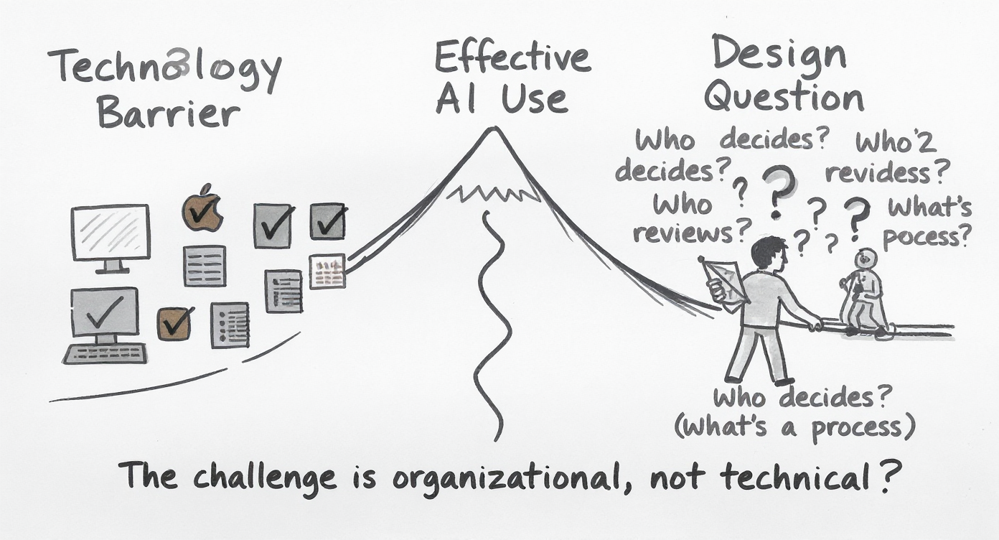

::: {.notes}

**It's Not the Technology:**

* AI models are mature
* Tools are increasingly accessible
* Computing power is affordable

**The Barrier Is:**

* Figuring out where humans should be in the loop
* Organizational design, not technical capability
* **Leadership question, not a technology problem**

*This is why faculty development and clear frameworks matter*

[Use when someone asks: "Why is this taking so long?" or "What's holding us back?"]

Here's what might surprise you about AI adoption challenges. When universities struggle - and businesses too - it's rarely because the technology doesn't work.

The AI models are mature. ChatGPT, Claude, Copilot - they're all accessible. Computing power is increasingly affordable, even in cloud-based education solutions.

[Point to PATH 1] The technology barrier is actually quite low now.

[Point to PATH 2] The real barrier? Nobody's figured out the human-AI division of labor.

Let me give you a concrete example from teaching: Do we trust AI to generate initial quiz questions, or do we require faculty review? If we require review, is someone actually reviewing, or are they rubber-stamping because they're overwhelmed?

When AI flags potential plagiarism, do we investigate immediately, or do we wait for human validation? What if the human always ignores the alerts because there are too many false positives?

When should AI provide student feedback directly, and when should it draft feedback for faculty review? Get this wrong and either you miss learning opportunities, or you create teacher bottlenecks.

**These aren't technical questions. They're organizational design questions. Leadership questions.**

[Make eye contact with Board] And that's actually good news for you. Because it means the path forward isn't "hire more AI experts" - though we need some. The path forward is "get clear on how decisions should be made, who's accountable, and where human judgment is essential."

That clarity - that intentional design of human-AI collaboration - is what separates institutions that thrive with AI from those that struggle.

It's why faculty development matters. It's why frameworks like the ones Tony and Renée are developing matter. It's why your guidance on industry expectations matters.

The technology is ready. The question is: Are we designing the human side thoughtfully?
:::

# Human-in-the-Loop for Education

::: {.notes}

**Applying the Framework to Teaching:**

**Level 1 - Human-in-the-Loop:**
* AI generates quiz questions → Faculty reviews and selects
* AI suggests essay feedback → Teacher personalizes and sends

**Level 2 - Human-on-the-Loop:**  
* AI provides 24/7 tutoring → Faculty monitors patterns, intervenes when needed
* AI flags at-risk students → Academic advisors validate and reach out

**Level 3 - Human-in-Command:**
* Faculty set: What AI can/cannot do, Assessment boundaries, Learning outcomes

*Same principle: Intentional design of where humans add value*

**SKETCH DESCRIPTION:**

[Only use if discussion goes deep into "How does this actually work in teaching?"]

Let me show you how this framework translates directly to education. Same three levels, different context.

[Point to top floor] Human-in-the-Loop: When AI generates quiz questions or drafts feedback, faculty review and decide what actually goes to students. Tony's approach - AI creates questions, but he checks them, catches errors, decides which ones to use. The AI provides speed and scale, faculty provides quality control and pedagogical judgment.

[Point to middle floor] Human-on-the-Loop: AI can provide 24/7 tutoring to students - answering questions, explaining concepts, providing practice problems. Faculty aren't reviewing every interaction - that would be impossible. But they're monitoring patterns. "Why are 15 students asking the same question about Chapter 5? Maybe my explanation wasn't clear." The AI handles volume, faculty handles pattern recognition and intervention.

My virtual company simulation is another example - AI chatbots play employees, students interact with them to complete tasks. I'm not involved in every conversation, but I review the transcripts afterward to assess student thinking.

[Point to bottom floor] Human-in-Command: At the foundation, faculty and university leadership set the boundaries. What is AI allowed to do? What assessment methods are permitted? What are the learning outcomes we're trying to achieve? These strategic decisions govern everything above them.

[Point to students at top] And notice: all three levels are in service of student learning. We're not using AI to replace teaching - we're using it to make teaching more effective and scalable.

The principle is exactly what you face in industry: Not "Should we use AI?" but "Where should humans be in the system to maximize value and maintain accountability?"

Different context, same leadership challenge.
:::